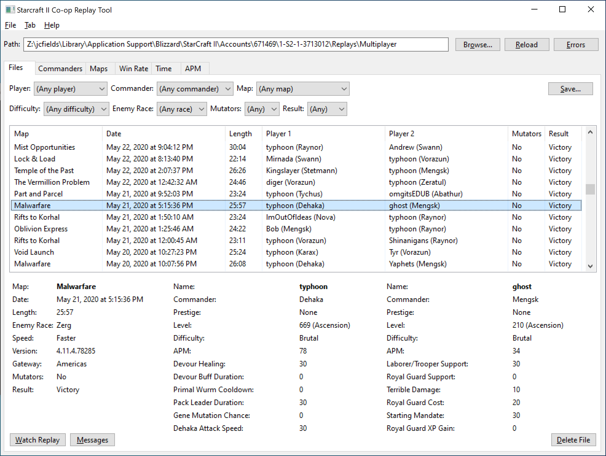
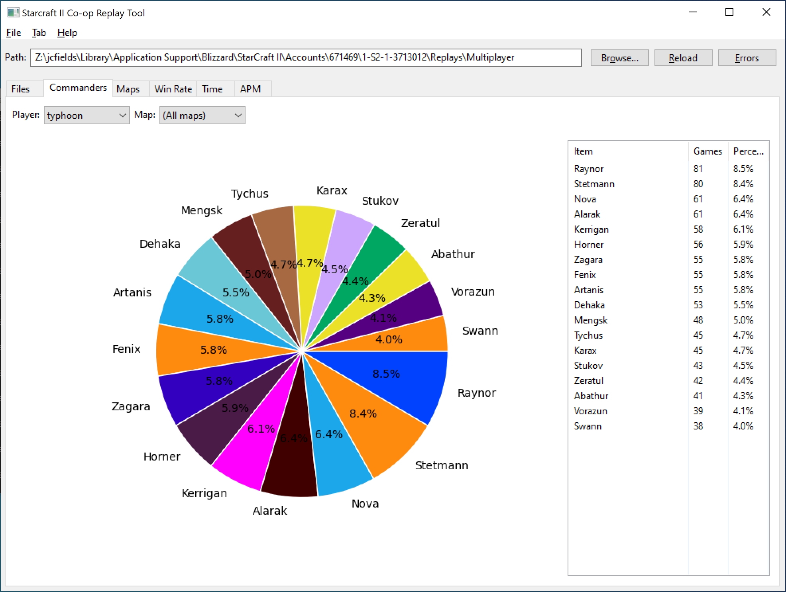
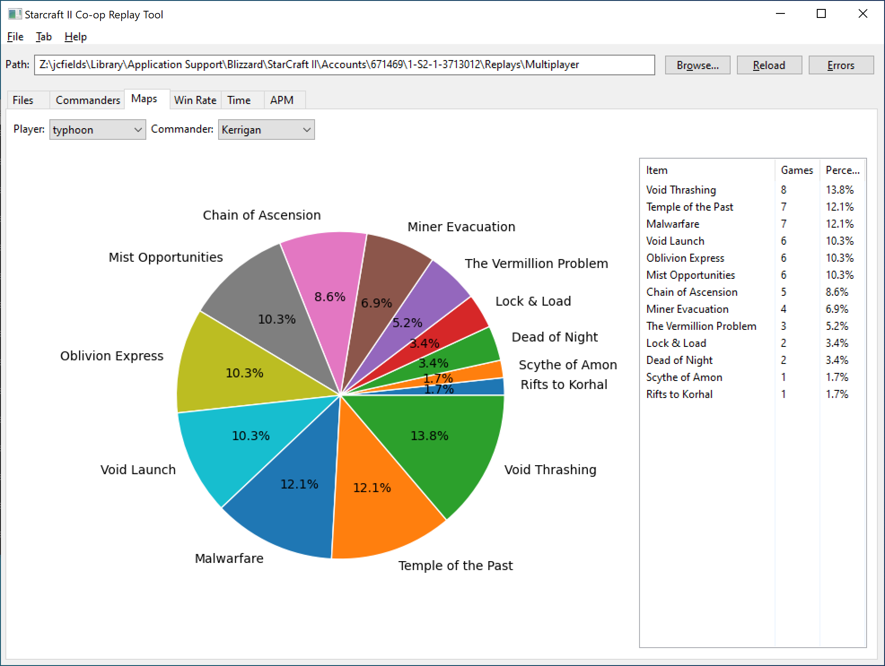
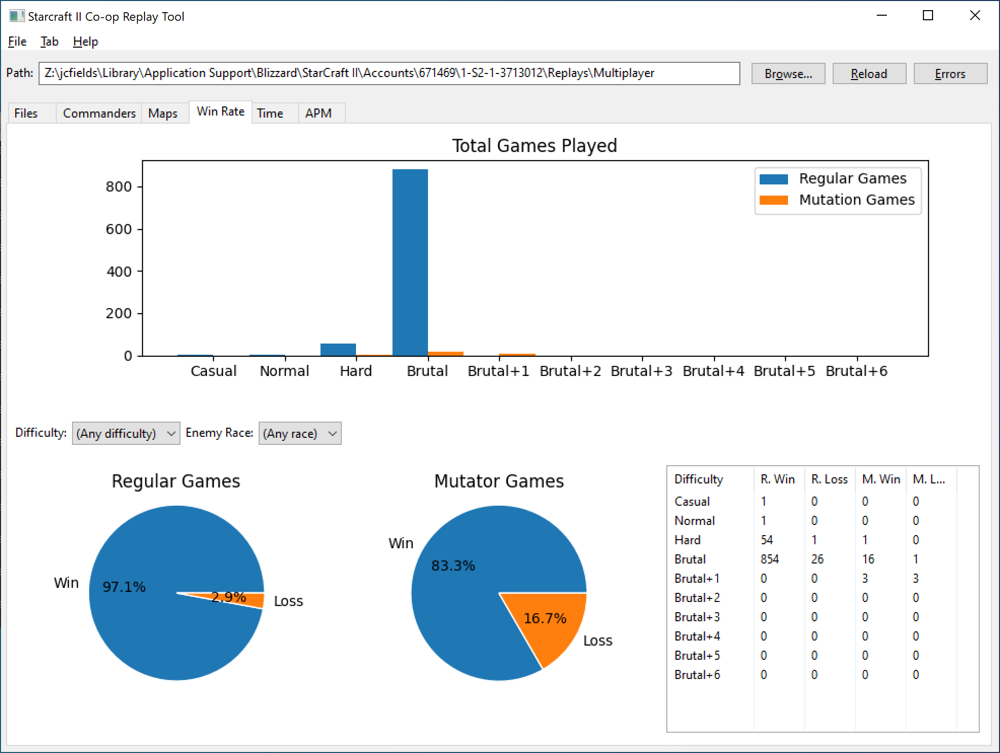
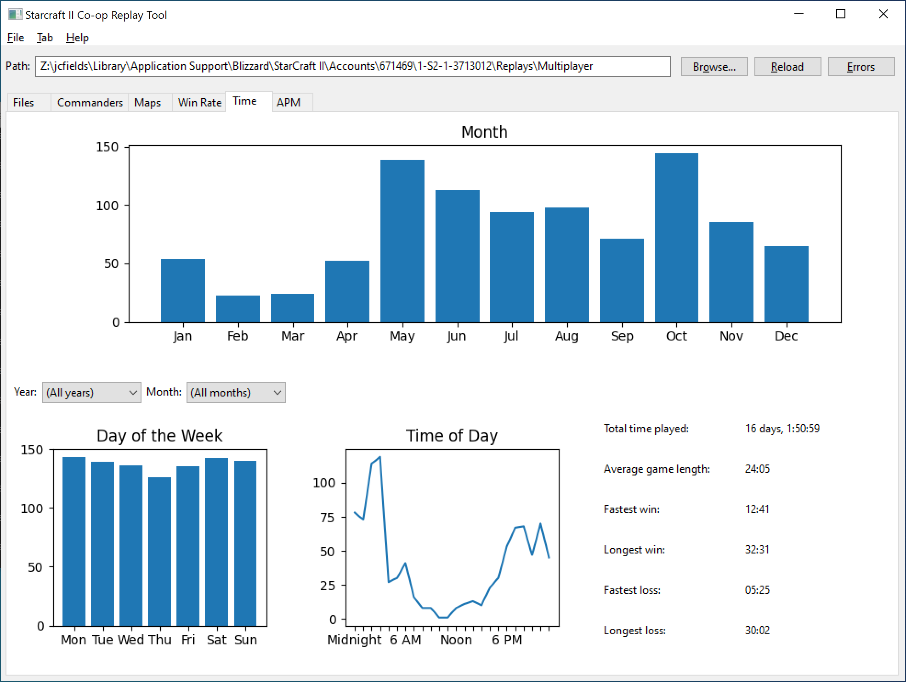
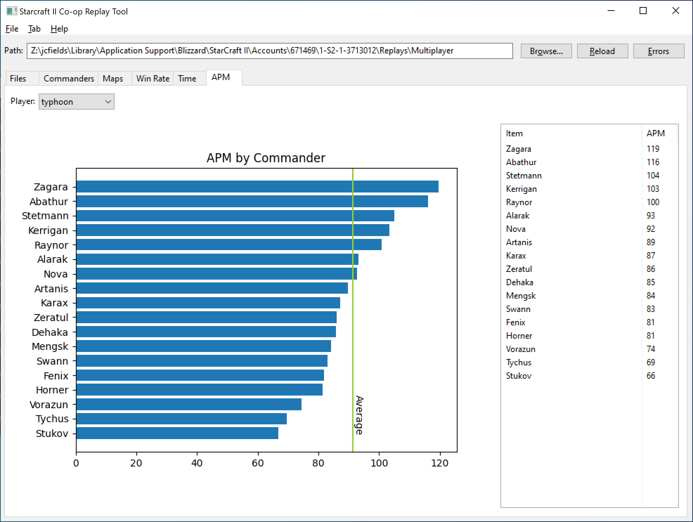

# starcraft2-coop-replay-tool

A utility for analyzing *Starcraft II* co-op mode replays. The utility shows general information about your co-op replays in aggregate and provides charts showing your most played commanders and maps. Written in Python 3 using the wxWidgets GUI toolkit.

It requires the following non-core modules to be installed:

- [wxPython](https://pypi.org/project/wxPython/)
- [matplotlib](https://pypi.org/project/matplotlib/)
- [mpyq](https://pypi.org/project/mpyq/)
- [sc2reader](https://pypi.org/project/sc2reader/)

## Installation

Install Python 3 on your computer using one of the [official installers](https://www.python.org/downloads/) or using a package manager such as [MacPorts](https://www.macports.org/). On Windows, the installer gives you the option to add Python to your PATH, which I recommend selecting since it makes it easier to run Python from the command line.

Then [download the files](https://github.com/jcfieldsdev/starcraft2-coop-replay-tool/archive/refs/heads/master.zip) from this repository and extract them somewhere. Open a Command Prompt or Terminal window to this directory and enter the following:

    pip install -r requirements.txt

This automatically installs the required dependencies for the program. If you get an error that PIP is not installed, you can install it manually by downloading and running [this script](https://bootstrap.pypa.io/get-pip.py). Then repeat the above command.

Then you can run the program by double-clicking the .py file icon in the file manager or with the following command:

    python replay.py

## Updating

You can update sc2reader by opening a Command Prompt or Terminal and typing the following:

    pip install sc2reader --upgrade

It is not typically necessary to update sc2reader when a new *Starcraft II* patch is released unless there are major changes to the replay format and newer replays are not being read properly.

## Guide

To select a replay directory, click the *Browse* button in the top-right corner of the window and navigate to the proper directory.

On Windows, the default directory for replays is:

    C:\Users\(your user name)\Documents\StarCraft II\Accounts\(number)\1-S2-1-(number)\Replays\Multiplayer

On Mac OS, the default directory for replays is:

    /Users/(your user name)/Library/Application Support/Blizzard/StarCraft II/Accounts/(number)/1-S2-1-(number)/Replays/Multiplayer

Once you select a directory, the program automatically scans it for replays. You can also force a rescan by clicking the *Reload* button. The directory is automatically saved to a preferences file upon exiting the program.

If there are any errors encountered while parsing replays, the *Errors* button in the top-right corner of the window is enabled. Clicking it shows a list of errors for the replays that could not be read.

### Files

The **Files** view shows a table with information about all of the replays in a directory.

You can filter the replays by several different criteria. The *Player* filter shows any player who appears in more than one game, with the most frequent player automatically selected. The *Commander* filter only matches games where the selected player is playing the selected commander.

The *Save* button exports information about all of the selected games (with any selected filters applied) to a CSV file, which can then be opened in a spreadsheet program such as Excel or Numbers for further analysis.

You can click a replay to view additional information, such as the duration of the game and the mastery choices of each player. The *Watch Replay* button in the bottom-left of the window opens the replay in *Starcraft II*. The *Messages* button shows you the chat log for the game. You can also delete a replay by clicking the *Delete File* button in the bottom-right of the window. You are asked to confirm before a replay is deleted.

### Commanders

The **Commanders** view shows a pie chart and a table of how often you have played each commander. You can filter it by player or by map.

### Maps

The **Maps** view shows a pie chart and a table of how often you have played each map. You can filter it by player or by commander.

### Win Rate

The **Win Rate** view shows a bar chart of how many games you have played at each difficulty level, as well as pie charts of showing your win rate in regular and mutation games. The pie charts can be filtered by difficulty level and by enemy race. A table in the bottom-right corner of the window shows the total number of wins and losses for each difficulty.

### Time

The **Time** view shows when you played each game, broken down by month, by day of the week, and by time of day. The day of the week and time of day graphs can be filtered by year and month. Some additional stats, such as the total amount of time played in all replays, is presented in a table in the bottom-right corner of the window.

Note that games less than 2 minutes long are excluded from calculations on all of the stats views in the program.

### APM

The **APM** view shows your average APM for each commander. The green line represents your average APM across all commanders. You can filter it by player.

## Acknowledgments

Based on an earlier [replay utility](https://www.reddit.com/r/starcraft2coop/comments/awgo45/subascension_leveling_guides_and_coop_replay_data/) by [Aommaster](https://aommaster.com/).

Uses the [sc2reader](https://github.com/ggtracker/sc2reader) library by [Graylin Kim](https://github.com/GraylinKim), [Kevin Leung](https://github.com/StoicLoofah), and contributors and the [mpyq](https://github.com/eagleflo/mpyq) library by [Aku Kotkavuo](https://github.com/eagleflo).

Uses [film strip icon](https://www.svgrepo.com/svg/31983/video-film-strip) by [SVG Repo](https://www.svgrepo.com).

## Authors

- J.C. Fields <jcfields@jcfields.dev>

## License

- [MIT license](https://opensource.org/licenses/mit-license.php)

## See also

- [*Starcraft II* Co-op Randomizer](https://github.com/jcfieldsdev/starcraft2-coop-randomizer)—A utility for picking a random co-op map or commander.
- [*Starcraft II* Hotkey Editor](https://github.com/jcfieldsdev/starcraft2-hotkey-editor)—A hotkey editor that includes all of the co-op mode units.
